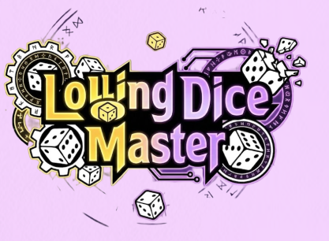

# KGA 1팀 1단 완성해 사전합반 프로젝트(Unity 협업 프로젝트)



# 🎨 Lolling : Dice Master

운에 맡기는 전략, 주사위로 결정되는 액션 로그라이크 RPG

본 프로젝트는 기획과 개발의 협업 역량 강화를 위해 진행된 KGA 1팀 <span style="color: magenta;">**'1단 완성해'**</span> 사전합반 프로젝트입니다.

## 🎮 프로젝트 개요

  - 장르: 액션 RPG / 로그라이크
  
  - 플랫폼: Windows (PC) / [itch.io 출시 목표]
  - 개발 기간: 2026-03-19 ~ 2026-04-09
  - 엔진: Unity 6.3 LTS (6000.3.9f1)
  - 입력: Keyboard & Mouse

## 👥 팀원 구성
- 총 13명

    - 기획 : 8명(강유민, 이유송, 김현우, 이동현, 정석현, 정우경, 박현수, 임소영)
    - 개발 : 5명(나현수, 김태성, 이승열, 이유찬, 조진행)


## 🕹 조작 방법
| 기능 | 입력 키 |
| :--- | :--- |
| **캐릭터 이동** | `W` `A` `S` `D` |
| **캐릭터 공격** | `마우스 좌클릭` / `우클릭` |
| **상호작용** | `F` |
| **UI 선택** | `마우스 클릭` |

## 🤝 팀약속

### 💻 개발파트

1. 1일 1빌드 원칙 준수

2. 모르는 경우 지체하지 않고 공유

3. 맡은 바에 최선을 다할 것

4. 일정이 있는 경우 미리 공유

5. 잠수타지 말기

### 📝 기획

1. 자리 비울 때 미리 말하기(ZEP/Discord)

2. 업무 일정이 늦춰질 경우에 미리 알려주기

3. 모를땐 팀원들에게 물어보기

4. 컨디션 잘 챙기기

5. 야근 할 때는 팀장/PM에게 미리 알려주기

6. AI에게 뇌 위탁하지 말기 (AI를 사용하되 내가 한 기획은 내가 정확히 알고 있어야 함)

---
## 🌿 브랜치 전략
### 브랜치 전략

- `main`: 최종 배포용 (Release)
  
- `develop`: 개발 통합 브랜치
  
- `개인 브랜치`: `develop` 하위에서 이니셜로 생성 (ex: `dev/NHS`)

### 커밋 메시지 규칙
`타입 : 작업 내용`
- `feat` : 새로운 기능 추가
- `fix` : 버그 수정
- `refactor` : 코드 구조 개선
- `docs` : 문서 수정
- `chore` : 기타 설정 작업

## Unity 프로젝트 폴더 구조
```
Assets/
 ├── _Animations/
 ├── _Scripts/ - NHS
               - JJH
               - KTS
               - LSY
 ├── _Prefabs/
 ├── _Materials/
 ├── _Scenes/
 └── ScriptableObjects/
```

## 🏗 프로젝트 구조 및 컨벤션

### 📂 폴더 구조
- `_Scripts/`: 개발자별폴더 운영
- `_Prefabs/`: Player, Enemy, UI, Map으로 상세 분류하여 충돌 방지
- `_Scenes/`: 1인 1씬 담당제 운영

### 📋 네이밍 규칙 (Naming Convention)
- **Class / Method**: `PascalCase` (대문자 시작)
- **Public Variable**: `camelCase` (소문자 시작)
- **Private Variable**: `_camelCase` (언더바 + 소문자 시작)
- **주의**: `a`, `b`, `temp` 등 의미 없는 변수명 사용 금지

### 🛠 기술적 특징
- **Input System**: Legacy 방식이 아닌 **New Input System** 도입
- **코드 관리**: Singleton 패턴 등 디자인 패턴을 고려한 구조 설계

---

## ⚠️ 이슈 및 진행 관리
- **이슈 등록**: 버그 리포트는 GitHub Issues 템플릿 사용
- **진행도 체크**: Notion 및 Google Sheets를 통한 실시간 업무 공유
- **Merge**: 팀장 승인 하에 머지 진행, 충돌 발생 시 반드시 공유 후 해결

---

### 📥 배포처
본 프로젝트는 **itch.io**를 통해 출시되었습니다.
